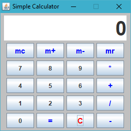

## Simple GUI Calculator

This version provides basic function of taking in 2 numbers for calculation,
together with memory capacities (memory clear, memory plus, memory minus, and memory recall).

